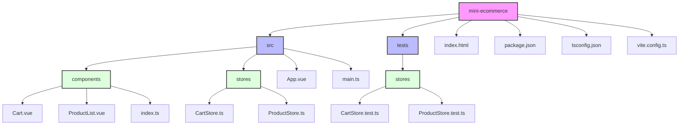

# Mini E-commerce Application

## Overview

This is a Vue 3 based mini e-commerce application with TypeScript support. It features a product listing, cart functionality, and responsive design.

### User Story 2 ( Persistent Cart)
**d) Persistent Cart:**

> As a customer, I want my shopping cart to persist when I refresh the page, so that I don't lose my selections accidentally.

- Implement a shopping cart that saves its state in local storage, allowing the cart to persist when the page is refreshed.

## Project Structure




## Key Components

### App.vue
The main component that structures the application layout and handles responsive design.

### ProductList.vue
Displays one product

### ProductList.vue
Displays the list of available products fetched from the ProductStore.

### Cart.vue
Shows the current items in the cart and allows for quantity adjustments.

## Stores

### ProductStore
- Manages the state of products
- Handles fetching products from an API
- Provides filtering functionality

### CartStore
- Manages the state of the shopping cart
- Handles adding, removing, and updating cart items
- Calculates total price and item count
- Persists cart data in localStorage

## Responsive Design

The application is responsive with a mobile-first approach:
- On desktop, products and cart are displayed side by side
- On mobile, a toggle button switches between product list and cart views

## Testing

Tests are written using Vitest and cover the main functionality of both ProductStore and CartStore.

## Getting Started

1. Clone the repository
2. Install dependencies: 
```sh
yarn
```
3. Run the development server: 
```sh
yarn dev
```
4. Run tests:
```sh
yarn test:unit
```

## Build

To build for production:
```sh
yarn build
```


## Technologies Used

- Vue 3
- TypeScript
- Pinia (for state management)
- Vite (as build tool)
- Vitest (for testing)